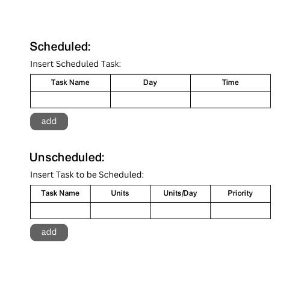
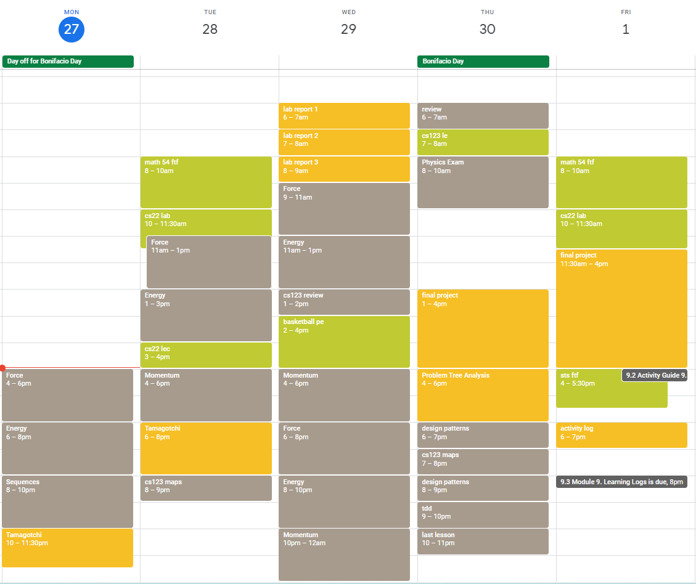
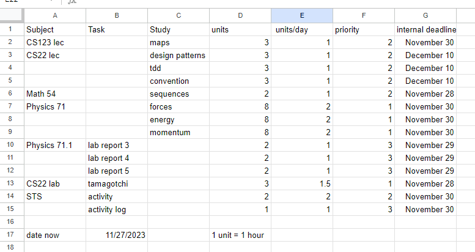

# CS22-Final-Project

BS in Computer Science 
CMSC 22 Final Project

To be submitted on December 15, 2023

## Installation
1. Navigate to the directory where you want to save the repository. 
2. Clone the repository to your local machine:

   ```bash
   git clone https://github.com/darahvia/CS22-Final-Project.git

## Guide
Example

1. Input Scheduled Task
Date Now: November 27, 2023
Task Name: Study Math54 Sequences
Deadline: December 5, 2023

2. Input Unscheduled Tasks

   1. Determine the number of days before the deadline.
      ```bash
      8 days
   2. Divide Units / (Units/Day) from user input
      ```
      Units: 5
      Units/Day: 2
   3. Distribute to days before deadline to the timetable's free slots.
      ```
      November 28, 2023: 10:00 - 12:00 
      November 30, 2023: 1:00 - 3:00
      December 3, 2023: 2:00 - 3:00
3. Timetable Schedule
   Organize the calendar timetable in the order:
   1. Scheduled tasks
   2. Highest Priority (depends on input sequence)
   3. Lowest Priority  (depends on input sequence)


notes:
user may add rest time after every task
##### Priority Note
1.	start of assignment to deadline
2.	(deadline - start) /  2 to deadline
3.	day of deadline


## User's end


#### User's Input


